# DART Lab Setup 
In this folder we show the instructions needed to use the DART platform in the [`Cognitive Robotics Mobile Robot Lab`](https://github.com/cor-mobile-robotics/lab-wiki).
Please read the wiki in the link. Most of the lab-related instructions are shown there in better detail. please also be aware that to book the lab you must first be added to the relevant outlook calendar, as detailed in the wiki.

## 1. Lab Setup
Read the  [`Cognitive Robotics Mobile Robot Lab`](https://github.com/cor-mobile-robotics/lab-wiki) wiki.


### Install ROS Packages to use the vicon system
To stream the DART state data from the vicon system onto a ROS network you will need to launch contents from the `vicon_pkg` package. This relies on the more general purpose 
[`vicon_bridge`](https://github.com/cor-mobile-robotics/vicon_bridge). For the user's convenience we have also put the `vicon_bridge` package in this repo, yet this will not be updated so use caution. To use these packages add them to a catkin workspace and build them. I.e.:

- Add the `vicon_bridge` package to a catkin workspace, taking it either from this repo or from [`vicon_bridge`](https://github.com/cor-mobile-robotics/vicon_bridge).
- Add the`vicon_pkg` from this repo to the same catkin workspace.
- build and re-source the workspace

## 2. Vehicle Setup (Operation Workflow)

When DART is set up correctly, the vehicle can be operated as follows:
1. Charge the batteris that supply the JetsonNano onboard the DART. This will take a few hours and the batteris can't be easily removed for charging so make sure they are charged before planning a day in the lab. Once charged they typically last a whole day. Since these are not Lipo batteries it is possible to charge them overnight, but please place them in an appropriate fire-proof area such as the battery cabinet behind the lab.
> [!NOTE]  
> The charger turns green when no voltage drop is detected. This means 1 of 2 things: the battery is charged, or the charger is not connected. The latter case may happen if there is a faulty contact! So use common sense to distinguish. I.e. if you know the battery should not be full yet and you see a green light while the charger is plugged in, maybe you have to wriggle the wire a bit to make a good contact.
<table>
  <tr>
    <td>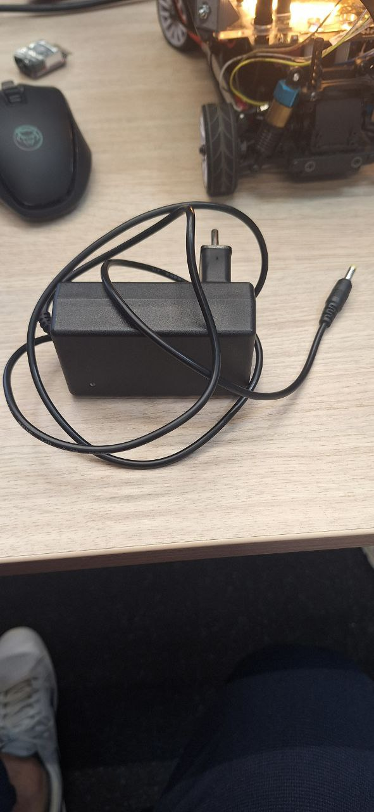</td>
    <td>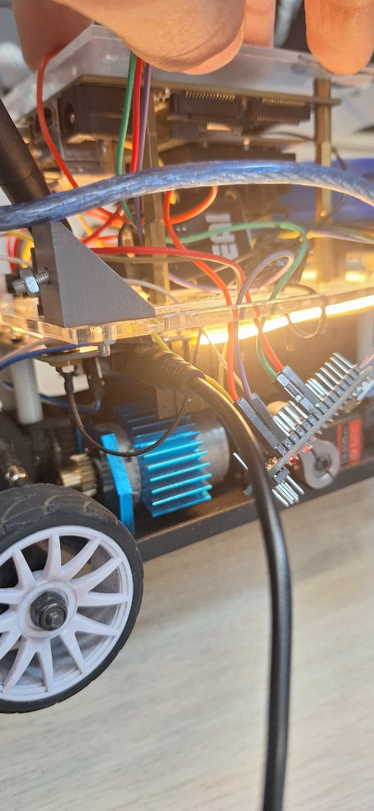</td>
    <td>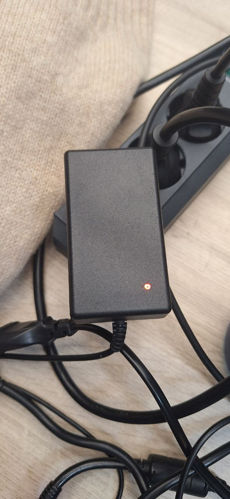</td>
    <td>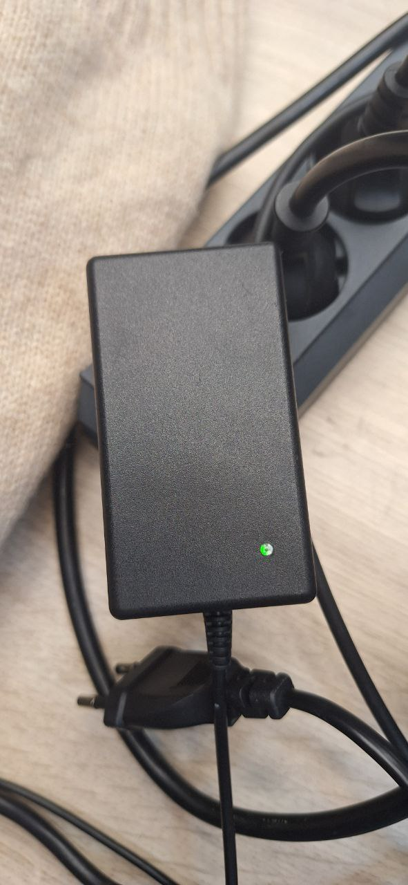</td>
  </tr>
</table>


1. Check if the lipo battery for the motor is charged. ALL voltage should read between 8.3V amd 7.2V. The meter will then display voltage for each of the 2 cells in the battery (their sum will be equal to the total displayed before).

<table>
  <tr>
    <td>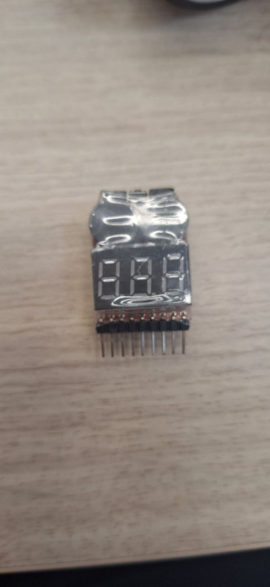</td>
    <td>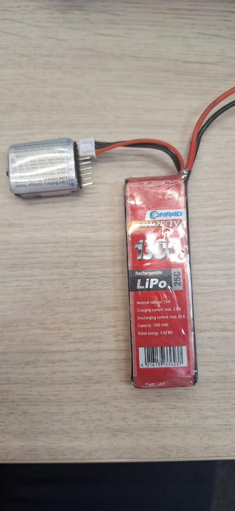</td>
    <td>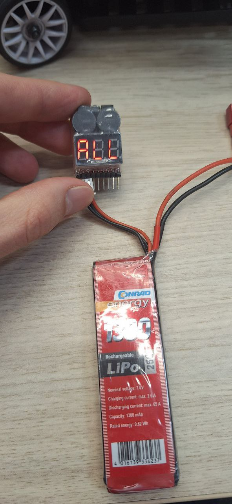</td>
    <td>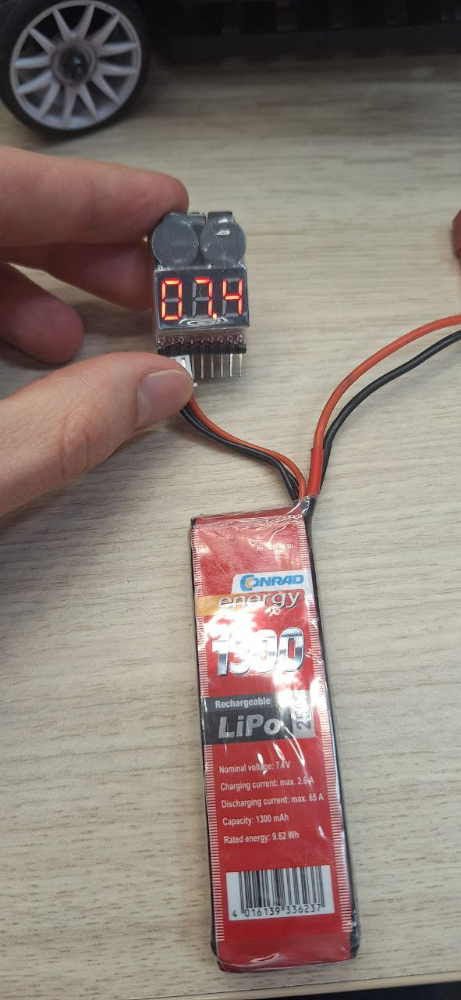</td>
  </tr>
</table>

2. Charge the lipo battery.  
   It's a good idea to have 1 battery always charging while using the car to avoid downtimes.  
   The light on the Lipo charger will go from red to green when the battery is charged.  

   If a battery is plugged in but no light turns on it is likely the battery is damaged.  
   This typically happens if the ESC module is left **ON** overnight. See below on how to make sure the ESC is off. 

> [!WARNING]  
> Always turn **OFF the ESC** after use.  
> Leaving it on will slowly drain the battery and can permanently damage it.

<table>
  <tr>
    <td>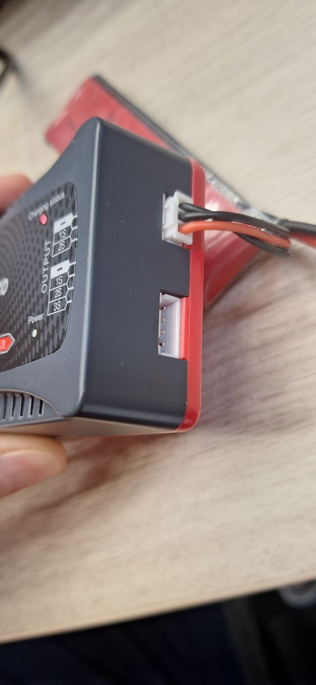</td>
    <td>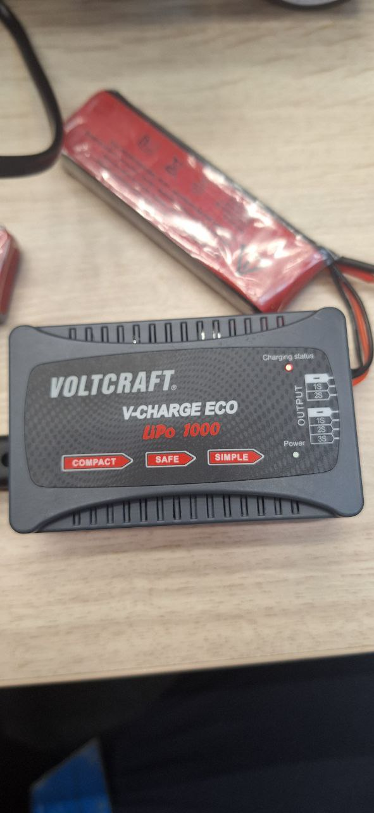</td>
  </tr>
</table>

4. Connect the Lipo battery on the DART. Once youhave a charged battery connect it to the ESC.
<table>
  <tr>
    <td>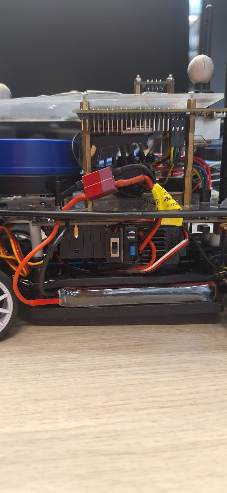</td>
  </tr>
</table>

3. The batteris that supply the JetsonNano onboard the DART are charged 


3. Charge the motor battery (before use).  
4. Power on the Jetson.  
5. Turn on the ESC and set the reference voltage to a **0-throttle** value.  
6. Connect the car to a screen and configure Wi-Fi (should already be working in the lab).  
   - **User:** `jetson`  
   - **Password:** `jetson`  

---

## 3. Remote Access to the Vehicle

You can access the vehicle remotely via SSH or VS Code Remote:

- Ensure you are on the same network.  
  - LAN cable preferred.  
  - Wi-Fi: `mrl-wifi-5g` (password under the modem).  
- Set up **VS Code Remote SSH** with keys for convenience.  
- **TODO:** check if the PAT is only required for `jetracer_ws`.  

### Running the Vehicle
- Start `roscore` (if this is **car 1**).  
- Run `racecar_universal.py` on your laptop (it will complain about safety, but this is expected).  

---

## 4. Laptop Setup

Update your `.bashrc` with the ROS master and your IP:  

```bash
export ROS_IP=192.168.1.84
export ROS_MASTER_URI=http://192.168.0.131:11311/  # vehicle 1 as master

