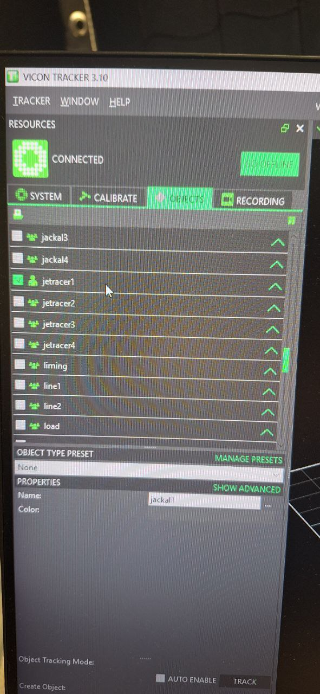

# DART Lab Setup 
In this folder we show the instructions needed to use the DART platform in the [`Cognitive Robotics Mobile Robot Lab`](https://github.com/cor-mobile-robotics/lab-wiki).
Please read the wiki in the link. Most of the lab-related instructions are shown there in better detail. please also be aware that to book the lab you must first be added to the relevant outlook calendar, as detailed in the wiki.
> [!NOTE]  
> These instructions assume you have a working controller that has been tested in the DART simulator.


## 1. Lab Setup
Read the  [`Cognitive Robotics Mobile Robot Lab`](https://github.com/cor-mobile-robotics/lab-wiki) wiki. This will show how to request access among other useful info.


## 2. Vehicle Hardware Setup 

When DART is set up correctly, the vehicle can be operated as follows:

1. Charge the batteris that supply the JetsonNano onboard the DART. This will take a few hours and the batteris can't be easily removed for charging so make sure they are charged before planning a day in the lab. Once charged they typically last a whole day. Since these are not Lipo batteries it is possible to charge them overnight, but please place them in an appropriate fire-proof area such as the battery cabinet behind the lab.
> [!NOTE]  
> The charger turns green when no voltage drop is detected. This means 1 of 2 things: the battery is charged, or the charger is not connected. The latter case may happen if there is a faulty contact! So use common sense to distinguish. I.e. if you know the battery should not be full yet and you see a green light while the charger is plugged in, maybe you have to wriggle the wire a bit to make a good contact.
<table>
  <tr>
    <td></td>
    <td></td>
    <td></td>
    <td></td>
  </tr>
</table>


2. Check if the lipo battery for the motor is charged. ALL voltage should read between 8.3V amd 7.2V. The meter will then display voltage for each of the 2 cells in the battery (their sum will be equal to the total displayed before).

<table>
  <tr>
    <td></td>
    <td></td>
    <td></td>
    <td></td>
  </tr>
</table>

3. Charge the lipo battery.  
   It's a good idea to have 1 battery always charging while using the car to avoid downtimes.  
   The light on the Lipo charger will go from red to green when the battery is charged.  

   If a battery is plugged in but no light turns on it is likely the battery is damaged.  
   This typically happens if the ESC module is left **ON** overnight. See below on how to make sure the ESC is off. 

> [!WARNING]  
> Always turn **OFF the ESC** after use.  
> Leaving it on will slowly drain the battery and can permanently damage it.

<table>
  <tr>
    <td></td>
    <td></td>
  </tr>
</table>

4. Connect the Lipo battery on the DART. Once youhave a charged battery connect it to the ESC.
<table>
  <tr>
    <td></td>
  </tr>
</table>


5. Power on the Jetson. Use the appropriate switch as shown in the image. The jetson will turn on. If it has been properly set up, it should automatically connect to the wifi and display its IP on the display. If it needs to be set up, plug in an HDMI cable, mouse and keyboard and set up automatic loggin-in and connecting to wifi. The DART has an Ubuntu 18.04 OS. The pictures show how to connect the HDMI cable. The username and password are as follows.
- **User:** `jetson`  
- **Password:** `jetson` 

<table>
  <tr>
    <td></td>
    <td></td>
    <td></td>
  </tr>
</table>


## 3. Remote Access to the Vehicle

You can access the vehicle remotely via SSH or VS Code Remote:

1. Ensure you are on the same network.  
  - LAN cable is preferred since streaming vicon data at high frequency will introduce delays if done over the WiFi.  
  - If using the Wi-Fi: `mrl-wifi-5g` (password under the modem).
<table>
  <tr>
    <td></td>
  </tr>
</table>

2. Set up **VS Code Remote SSH** with keys for convenience. Note that you don't need to set up the virtual machine indicated in the tutorial since we have a physical remote machine (the DART you want to access remotely). Following these steps will allow you to run software on the DART, edit files ecc, without pluggin in the HDMI cable every time. Highly recommended.
- [Remote - SSH](https://code.visualstudio.com/docs/remote/ssh-tutorial) can also be installed from the VS code extensions directly from VS code.


### 4. Running the Vehicle
On the DART platform (either by SSH or directly with an HDMI cable + mouse and keyboard) run the following:
- Start `roscore` (if this is **car 1**).
```
roscore
```
- Run `racecar_universal.py` (it will complain about safety not being published, but this is expected). This will ensure commands published to the steering and throttle topics will be executed by the hardware. 
```
rosrun racecar_pkg racecar_universal.py
```

## 5. Laptop Setup
On your laptop:

1. Update your `.bashrc` with the ROS master and your IP:  

```bash
export ROS_IP=<YOUR LAPTOP'S IP>
export ROS_MASTER_URI=http://192.168.0.131:11311/  # vehicle 1 as master
```
2. Run a safety toggle script to publish safety values. This is a safety requirement since if the connection stops between the laptop and the vehicle, it might continue to drive away and hit a wall (this indeed has happened a few times).
```
rosrun racecar_pkg safety_toggle.py
```

3. Run you controller. This should send values to the `/throttle_1` and `/steering_1` topics.

## 6. Set up the vicon system to track the DART platoform
1. Turn on the vicon desktop. There is a switch on the right to give power to the system.
2. Log into the desktop computer. 
- **User:** `vicon`  
- **Password:** `vicon`
3. Run the vicon app
4. Add the DART to the actively tracked objects. It should now apear on the screen. If the object needs to be created, alt+click and drag on the markers, then add the name of the object. Also check online how to add a new object to a vicon system.
5. Enable TRACK mode. This ensures better performance but disables creating new objects.


<table>
  <tr>
    <td></td>
    <td></td>
    <td></td>
    <td></td>
  </tr>
</table>

6. It might be necessary to recalibrate the vicon if you notice the position is acting erratically. To do this you will need the calibration wand in the ARM 2 cabinet (the one looking towards the lab). It is in the bue box. Please follow the instruction to [`calibrate the vicon system`](https://help.vicon.com/space/Nexus216/11606902/Calibrate+a+Vicon+system).

<table>
  <tr>
    <td></td>
  </tr>
</table>


## 6. Install ROS Packages to use the vicon system
To stream the DART state data from the vicon system onto a ROS network you will need to launch contents from the `vicon_pkg` package. This relies on the more general purpose 
[`vicon_bridge`](https://github.com/cor-mobile-robotics/vicon_bridge). For the user's convenience we have also put the `vicon_bridge` package in this repo, yet this will not be updated so use caution. To use these packages add them to a catkin workspace and build them.

1. Add the packages to a catkin workspace.
- Add the `vicon_bridge` package to a catkin workspace, taking it either from this repo or from [`vicon_bridge`](https://github.com/cor-mobile-robotics/vicon_bridge).
- Add the`vicon_pkg` from this repo to the same catkin workspace.
- build and re-source the workspace

2. Stream vicon data to your laptop. First make sure you are on the same network. Use the LAN cable if possible. 
```
roslaunch vicon_pkg jetracer_1_stream.launch
```
If more than 1 vehicle needs to be streamed, you can instead launch:
```
roslaunch vicon_pkg jetracer_all_stream.launch
```


> [!NOTE]  
> The name of the object that will be streamed, needs to match exactly between this launch file and the vicon system. Check this in the lanch file if you have renamed objects on the vicon desktop computer.

3. The vicon will stream only position data. To get the velocity data, you can simply differentiate the position. It seems to be working well enough. Add the method `vicon_position_2_velocity` to your controller class.


## 7. ESC calibration
1. Go back to the robot and turn on the ESC. You should here 2 short beeps.
2. On the laptop release the safety. The ESC will now beep for a longer time. This will set the "0" reference to the ESC.
3. Just to be sure go back to the robot, switch off the ESC and turni it back on. You should hear 2 short beeps followed by 1 long beep. The ESC is not properly set.
4. By releasing the safety the car should now race forwards!

## 8. Closing up for the day
Remeber to turn off and store away the equipment when leaving the lab. This in cludes:
1. Turing off the vicon desktop computer.
2. Turing off the switch next to it.
3. Turing off the ESC module and *DISCONNECTING* the Lipo battery to avoid discharging and damaging it overnight.
4. Locking the DART platform in the cabinet.


