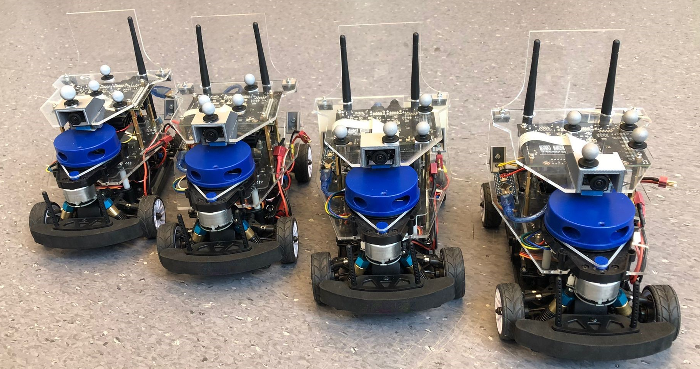
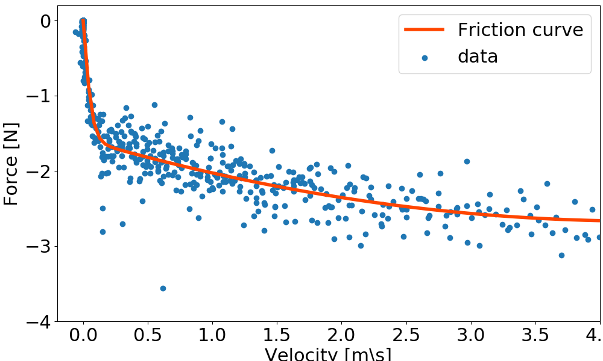
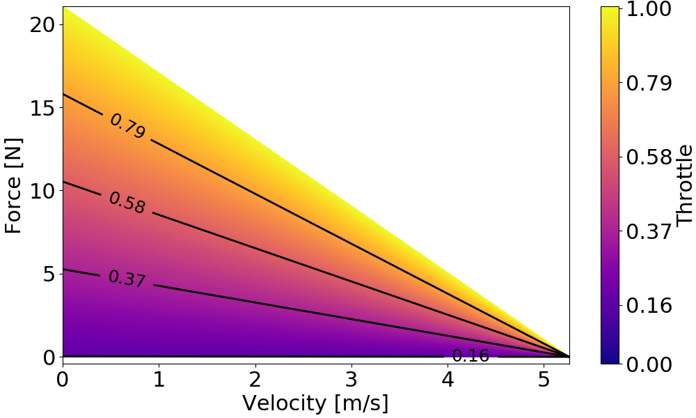
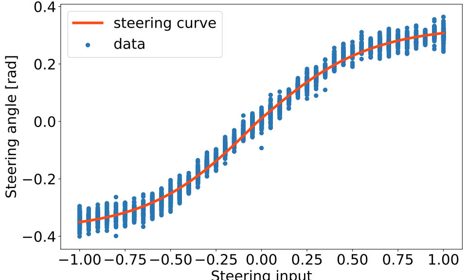
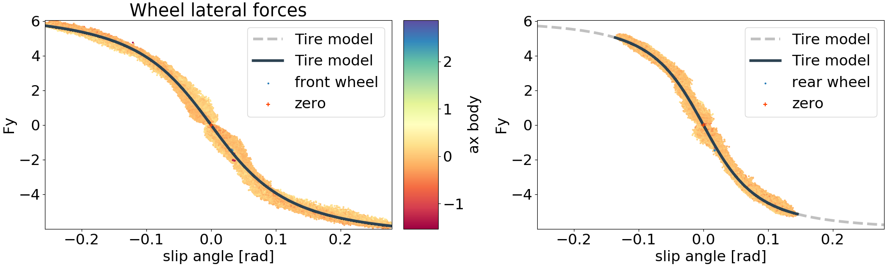
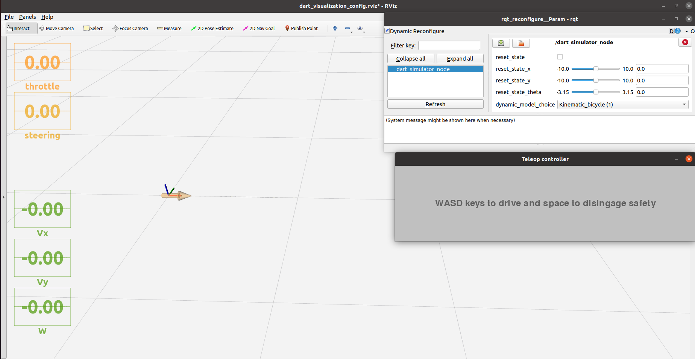

# DART: Delft's Autonomous-driving Robotic Testbed

<p align="center">
  
</p>


## What's DART?
DART is a small-scale car-like robot that is intended for autonomous driving research. It's based on the commercially available [JetracerPro AI kit](https://www.waveshare.com/wiki/JetRacer_Pro_AI_Kit)  available from Waveshare and features  additional sensors and a few other upgrades.


## What's in this repo?
This repository contains the code to set up and start driving with DART! In particular you can find:
- **Build instructions** to replicate the DART.
- **ROS packages** that can be deployed on the platform to quicky get you started on your experiments. They feature basic functionalities, low level, high level controllers and a lidar-based SLAM pipeline.
- **Simulator** to test and debug before heading out to the lab. It replicates the sensor readings you would get from the vehicle, so no time wasted between simulating and testing.
- **System Identification** code needed to build a kinematic and a dynamic bicycle model, as well as the relative data set. 

## Build instructions

To see the full build instructions go to [Build instruction section](build_instructions/).

## Software setup
To start using the robot first of all set up the operating system and ROS installation on the Jetson-Nano [link](https://www.waveshare.com/wiki/JetRacer_Pro_AI_Kit). Then do the following:
- Clone this repo.
```
git clone https://github.com/Lorenzo-Lyons/DART.git
```
- Install Lidar drivers from the manufacturer [link](https://www.ydlidar.com/service_support/download.html)
- Set up the arduino as described in the [arduino_readme](Arduino_files/README_arduino.md)
- set up car_name system variable. This is necessary to run multi-robot experiments and many scripts need this variable to identify which vehicle the script is running on. Add the following lines to the .bashrc file in the home directory (each car needs a different number):
```
export car_number="1"
```
- Place the ros packages (marked with the "_pkg" suffix) in a [catkin workspace](http://wiki.ros.org/catkin/Tutorials/create_a_workspace). Note that the package "dart_simulator_pkg" is not needed on the robot, while the package "lidar_ros" is not needed if running the code in simulation.


### System identification
The System_identification_data_processing folder contains the code and data required for system identification and can be run as simple python scripts with your favourite code editor like [Visual Studio Code](https://code.visualstudio.com/). To start using DART it's thus necessary to understand what happens when we provide the system with a certain input, i.e. we need to identify the system's model. The folder System_identification_data_processing cointains the code and the data to build a kinematic and a dynamic bicycle model. The kinematic bicycle model is suitable for most kind of experiments that don't require to reach high speeds. Since it is simpler and computationally lighter we suggest trying it first and switching to the dynamic kinematic bicycle model only if actually needed. Also note that the data necessary to fit the kinematic bicycle model can be collected with the on-board sensors, while the dynamic bicycle model requires an external motion capture system. Let's start with the kinematic model.

**Kinematic bicycle model:**
```math
\begin{align*}\begin{bmatrix}\dot{x}\\\dot{y}\\\dot{\eta}\\\dot{v}\end{bmatrix}&=\begin{bmatrix}v\cos{\eta}\\v\sin{\eta}\\v \tan(\delta(s))/l\\(F_m(\tau,v) + F_f(v))/m\end{bmatrix}
\end{align*}
```
Where $x,y,\eta,v$ are respectively the x-y position,orientation and longitudinal velocity. $l=0.175$ m is the length of the robot and $m=1.67$ Kg is the mass. The inputs to the platform are throttle $\tau$ and steering $s$ values, both provided in non-dimensional normalized values:
```math
\begin{align*}\tau \in [-1,+1]\\ s \in [-1,+1]\end{align*}
```
To do so we broke down the kinematic bicycle model into its elemental components and identified them one by one. This is much simpler that attempting to identify them all at once from a single dataset. Each step that we took has its corresponding numbered python script:

1. Identify the friction $F_f(v)$
2. Identify the motor cahracteristic curve $F_m(\tau,v)$
3. Map the steering input $s$ to steering angle $\delta$ [rad]
4. Identify the steering delay

Once this is done we can move on to the dynamic bicycle model.

**Dynamic bicycle model:**
```math
\begin{align*}
    \begin{bmatrix}\dot{x}\\\dot{y}\\\dot{\eta}\\\dot{v}_x\\\dot{v}_y\\\dot{\omega}\end{bmatrix}&=
    \begin{bmatrix}v_x\cos{\eta}- v_y\sin{\eta}\\
    v_x\sin{\eta}+ v_y\cos{\eta}\\
    \omega\\
    (F_{x,r}+F_{x,f}\cos{\delta}-F_{y,f}\sin{\delta})/m +\omega v_y\\
    (F_{y,r}+F_{y,f}\cos{\delta}+F_{x,f}\sin{\delta})/m -\omega vx\\
    (l_f(F_{y,f}\cos{\delta}+F_{x,f}\sin{\delta})-l_rF_{y,r})/I_z\end{bmatrix},
\end{align*}
```
where $v_x$ and $v_y$ are the velocity components of the centre of mass measured in the vehicle body frame. $l_f$ and $l_r$ are the distances between the centre of mass and the front and rear axle, respectively. $\omega$ is the yaw rate and $I_z$ is the moment of inertia around the vertical axes. The front and rear tire forces components $F_{x,f}$,  $F_{f,y}$,  $F_{r,x}$ and $F_{r,y}$ are measured in the respective tire's body frame. To evalute the lateral forces many different tire models are available, we used the famous [Pacejka magic formula](https://www.tandfonline.com/doi/pdf/10.1080/00423119208969994) for the front tire and a simple linear model for the rear tire.

```math
\begin{align*}
F_{y,f} &= D \sin (C \arctan (B \alpha_f - E (B \alpha_f - \arctan (B \alpha_f))))\\
F_{y,r} &= C_r \alpha_r
\end{align*}
```
Where $\alpha_f$ and $\alpha_r$ are the front and rear slip angles defined as:

```math
\begin{align*}
\alpha_f &= -\arctan(v_y + \omega lf) + \delta\\
\alpha_r &= -\arctan(v_y - \omega lr). 
\end{align*}
```
The code relative to the tire model identification is in:

5. fitting tire model

**Fitting Results**


|<br>Friction Curve|<br>Motor Curve|
|:-:|:-:
|<br>**Steering input to steering angle map**|<br>**Tire models**|


## Simulator
<p align="center">
  
</p>
To run the simulator you can use the provided launch file:

```
roslaunch dart_simulator_pkg dart_simulator.launch
```
You can then control the simulated vehicle using the keyboard:
```
rosrun racecar_pkg teleop_keyboard.py
```


## Available low level controllers

The package *racecar_pkg* cointains scripts to run base functionalities, like send commands to the motors, that have been obtained by modifying the software in the github repo [cytron_jetracer](https://github.com/CytronTechnologies/cytron_jetracer). It also features low level controllers that use the previously described kinematic bicycle model to control the robot. 

**Reference velocity and steering angle controller** Using the previously derived kinematic bicycle model we prepared a low vel controller that allows to control the vehicle by sending longitudinal velocity reference and steering angle inputs. This can be quite convenient a number of use cases. To use this controller simply run the corresponding launch file:

```
roslaunch racecar_pkg racecar_steer_angle_v_ref.launch
```
And send commands to the topics *v_ref_<car_number>* and *steering_angle_<car_number>*. This can be done for example with the gamepad provided in the JetracerPro AI kit. Run the following script:

```
roslaunch racecar_pkg gamepad_steer_angle_v_ref.py
```

For those interested in how the controller works, the steering angle is mapped to the non-dimensional steering input by inverting the mapping obtained in the system identification step. The velocity is tracked using a feedforward-feedback controller, where the current vehicle velocity $v$ is provided by the encoder. 

```math
\begin{align*}
\tau = - K(v-v_{ref}) + \tau^{ff}
\end{align*}
```
Where $K$ is a gain and $\tau^{ff}$ is defined as:
```math
\begin{align*}
\tau^{ff} =\tau\text{  s.t.  } F_m(\tau,v_{ref}) + F_f(v_{ref})=0
\end{align*}
```


## Lane following controller

<p align="center">
  
</p>

The lane following controller allows the vehicle to autonomously track a user-defined reference track (pink line in the video) at a certain reference velocity. It requires a previously built map of the environment.

To build a map of the environment first launch the file:

```
roslaunch localization_and_mapping_pkg mapping_controller.launch
```
Note that the vehicle needs to navigate the environment in order to map it. A convenient way of doing so is to run the velocity tracking controller described in the previous section. We also assume that the lidar has been properly set up as detailed in the building instructions.


To save the map type:
```
rosrun map_server map_saver -f map_name
```

To use the map in the lane following controller first make sure it is in the folder *saved_maps_from_slam* located in the localization_and_mapping_pkg package. Then edit the *map_file* parameter in *the map_server.launch* file to match the newly created map. Then launch the map server file.

```
roslaunch localization_and_mapping_pkg map_server.launch
```
Now launch the lane following controller.

```
roslaunch lane_following_controller_pkg lane_following_controller.launch
```
To modify the reference path edit the function *produce_track* located in the file *functions_for_controllers.py*.


