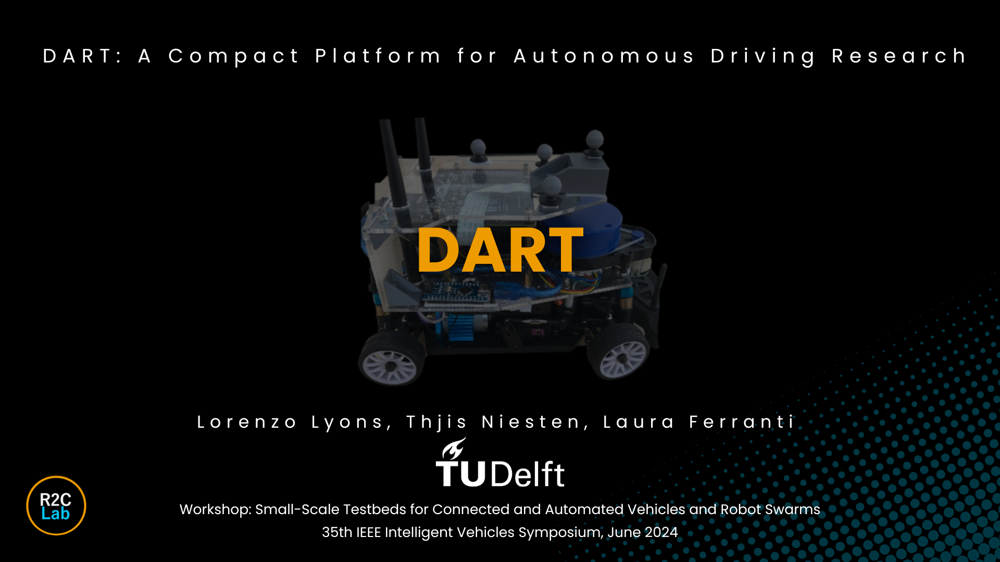
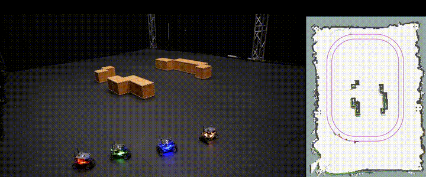
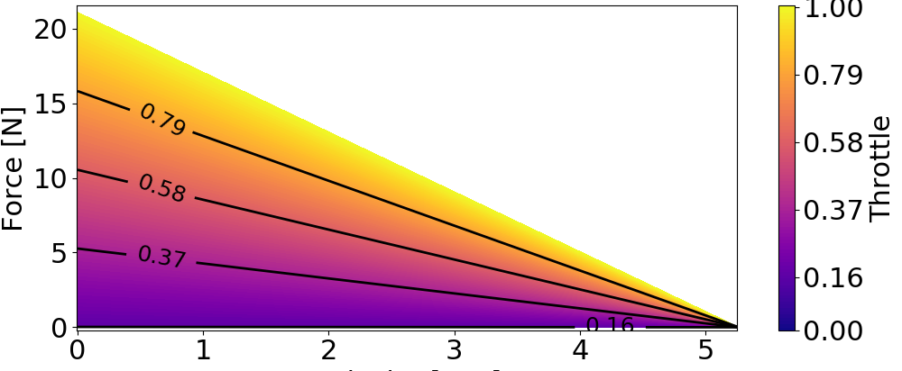

# DART: Delft's Autonomous-driving Robotic Testbed

<p align="center">
  
</p>


## What's DART?
DART is a small-scale car-like robot that is intended for autonomous driving research. It's based on the commercially available [JetracerPro AI kit](https://www.waveshare.com/wiki/JetRacer_Pro_AI_Kit)  available from Waveshare and features  additional sensors and a few other upgrades.


Refer to our conference paper for further details:
[DART conference paper](https://ieeexplore.ieee.org/document/10588526)

## Model Predictive control for racing
<p align="center">
  
</p>

## Vehicle Platooning
<h3 align="center"><strong>On-board localization and Sensor-based ACC</strong></h3>

<p align="center">
  
</p>


<h3 align="center"><strong>Distributed autonomous platoon rearranging</strong></h3>

<p align="center">
  
</p>


[Platooning Code](https://github.com/Lorenzo-Lyons/Distributed-Attack-Resilient-Platooning-Against-False-Data-Injection)

[Platooning Paper](https://arxiv.org/pdf/2411.04789)


## What's in this repo?
This repository contains the code to set up and start driving with DART! In particular you can find:
- **Build instructions** to replicate the DART.
- **ROS packages** that can be deployed on the platform to quicky get you started on your experiments. They feature basic functionalities, low level, high level controllers and a lidar-based SLAM pipeline.
- **Simulator** to test and debug before heading out to the lab. It replicates the sensor readings you would get from the vehicle, so no time wasted between simulating and testing.
- **System Identification** code needed to build physics-based models: kinematic and dynamic bicycle model, and a data-driven Stochastic Variational Gaussian Process model. 

## Build instructions

To see the full build instructions go to [Build instruction section](build_instructions/).

## Software setup: on the robot
To start using the robot first of all set up the operating system and ROS installation on the Jetson-Nano [link](https://www.waveshare.com/wiki/JetRacer_Pro_AI_Kit). 
> [!NOTE]
> Connecting over the wifi is not needed. The most practical way to access the jetson is to connect a screen, keyboard and mouse. In later stages connecting with the Visual Studio code ssh extention and setting up authentication keys is recommended [VS ssh](https://code.visualstudio.com/docs/remote/ssh) , [VS code keys tutorial](https://code.visualstudio.com/docs/remote/ssh-tutorial).


Then do the following:
- Clone this repo.
```
git clone https://github.com/Lorenzo-Lyons/DART.git
```

*Select the ROS packages:* from the available ros packages in the folder "ROS_packages" select the ones you wish to install. These will need to be placed in a catkin workspace and then built. [ROS set up catkin workspace tutorial](https://wiki.ros.org/catkin/Tutorials/create_a_workspace). For basic functionalities just install the racecar_pkg.

*set car number:* To avoid conlficts when using multiple cars the environment variable "car_number" needs to be set. Navigate to the .bashrc file in the home directory and add the following lines (setting the appropriate number):

```
export car_number=1
export car_number_str='_1'
```
As a quick test run the following:
```
rosrun racecar_pkg racecar_universal.py
```
And control it with the gamepad:
```
rosrun racecar_pkg gamepad_basic.py
```


## Software setup: Simulator on your laptop
<p align="center">
  
</p>

Clone the repo as for the robot setup.
```
git clone https://github.com/Lorenzo-Lyons/DART.git
```

Install DART_dynamic_models python package. Navigate to the pacakge root folder *DART_dynamic_models* and install:

```
pip install dist/DART_dynamic_models-0.1.0-py3-none-any.whl
```

To use the simulator you will need a working ROS intallation, we used [ROS noetic](http://wiki.ros.org/noetic/Installation/Ubuntu) but other ROS versions should work too. You will then need to place the packages in a [catkin workspace](http://wiki.ros.org/catkin/Tutorials/create_a_workspace). 

The simulator replicates the output of a Vicon external motion capture system. To run the simulator run the following: 

```
roslaunch dart_simulator_pkg dart_simulator.launch
```
As a quick test, you can then control the simulated vehicle using the keyboard:
```
rosrun racecar_pkg teleop_keyboard.py
```


### System identification
To start using DART it's thus necessary to understand what happens when we provide the system with a certain input, i.e. we need to identify the system's model. The folder *Data_processing* cointains the code and the data to build the pysics-based kinematic and dynamic bicycle model, as well as the data-driven SVGP model.

The kinematic bicycle model is suitable for most kind of experiments that don't require to reach high speeds. Since it is simpler and computationally lighter we suggest trying it first and switching to the dynamic kinematic bicycle or data-driven SVGP model only if actually needed. Also note that the data necessary to fit the kinematic bicycle model can be collected with the on-board sensors, while the dynamic bicycle model and GP model require an external motion capture system.

To perform the system identification, run through the scripts following the numbering order, i.e. start from *1_0_fitting_friction_on_board_sensors*.
> [!NOTE]
> The outputs of the each script are simply printed out, so to update the model parameters, the user must copy-paste them in the function *dart_dynamic_models.model_functions*. When running the SVGP identification script the SVGP parameters will be automatically saved in the same folder the fitting data was loaded from.


**Fitting Results**
As a preview we show the physics-based identified sub-models.


|<br>Friction Curve|<br>Motor Curve|
|:-:|:-:
|<br>**Steering input to steering angle map**|<br>**Tire models**|


## Simulator
<p align="center">
  
</p>
The simulator matches the same ROS node and topic structure as in the real vehicle.

To run the simulator you can use the provided launch file:

```
roslaunch dart_simulator_pkg dart_simulator.launch
```
As a quick test, you can then control the simulated vehicle using the keyboard:
```
rosrun racecar_pkg teleop_keyboard.py
```


## Available low level controllers

The package *racecar_pkg* cointains scripts to run base functionalities, like send commands to the motors, that have been obtained by modifying the software in the github repo [cytron_jetracer](https://github.com/CytronTechnologies/cytron_jetracer). It also features some low level controllers. 

**Reference velocity and steering angle controller** This allows to  conveniently control the vehicle by sending longitudinal velocity reference and steering angle inputs. This controller relies on the kinematic bicycle, so it is suitable for low-medium speeds. To use this controller run the launch file:

```
roslaunch racecar_pkg racecar_steer_angle_v_ref.launch
```
Then send commands to the topics *v_ref_<car_number>* and *steering_angle_<car_number>*. This can be done for example with the gamepad provided in the JetracerPro AI kit. Run the following script:

```
roslaunch racecar_pkg gamepad_steer_angle_v_ref.py
```


## Lane following controller

<p align="center">
  
</p>

The lane following controller allows the vehicle to autonomously track a user-defined reference track (pink line in the video) at a certain reference velocity. It requires a previously built map of the environment.

To build a map of the environment first launch the file:

```
roslaunch localization_and_mapping_pkg mapping_controller.launch
```
Note that the vehicle needs to navigate the environment in order to map it. A convenient way of doing so is to run the velocity tracking controller described in the previous section. We also assume that the lidar has been properly set up as detailed in the building instructions.


To save the map type:
```
rosrun map_server map_saver -f map_name
```

To use the map in the lane following controller first make sure it is in the folder *saved_maps_from_slam* located in the localization_and_mapping_pkg package. Then edit the *map_file* parameter in *the map_server.launch* file to match the newly created map. Then launch the map server file.

```
roslaunch localization_and_mapping_pkg map_server.launch
```
Now launch the lane following controller.

```
roslaunch lane_following_controller_pkg lane_following_controller.launch
```
To modify the reference path edit the function *produce_track* located in the file *functions_for_controllers.py*.


