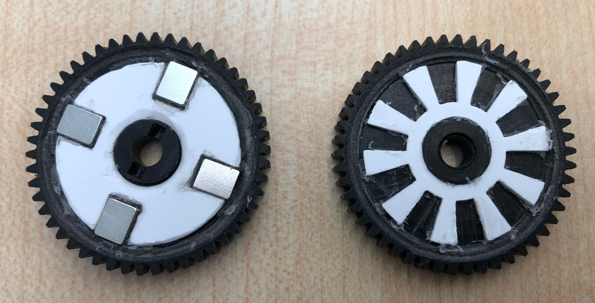
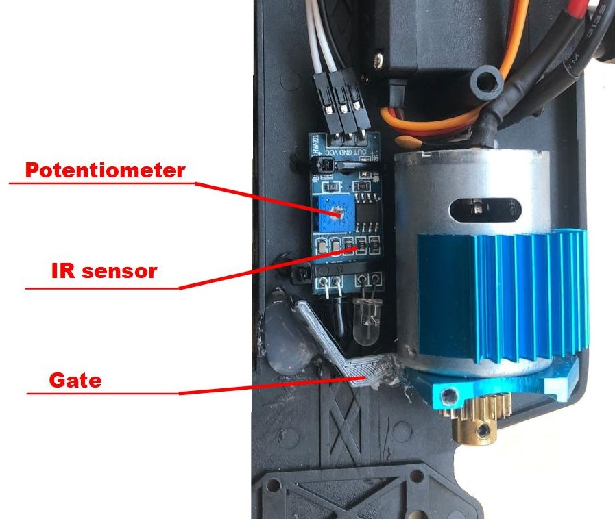
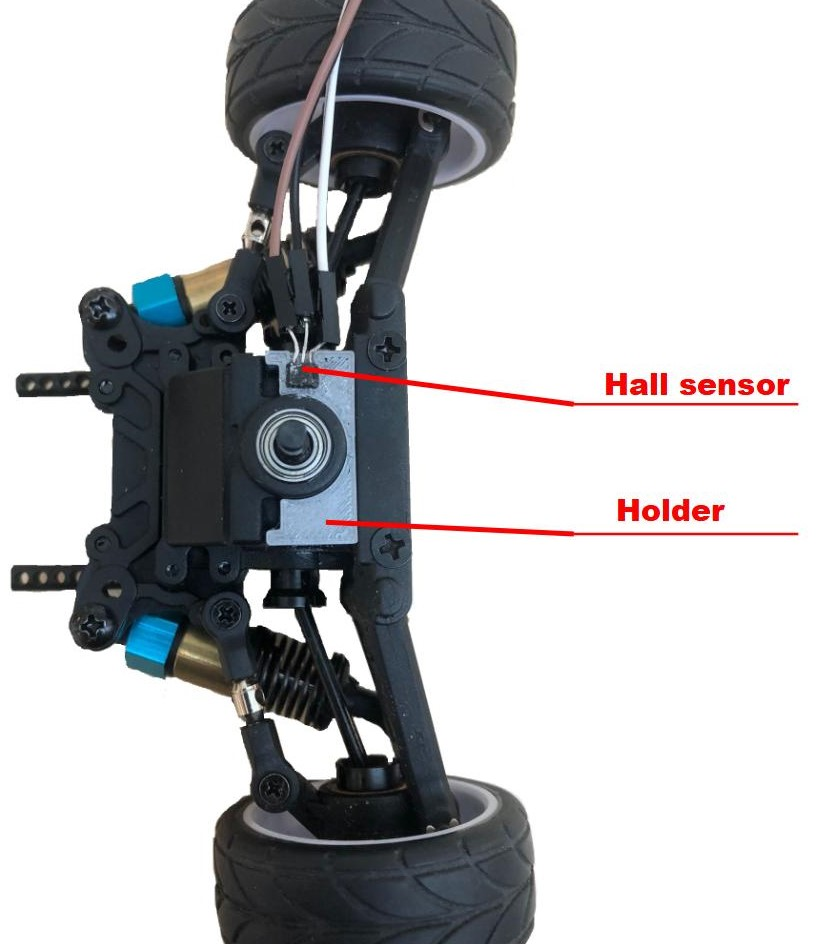
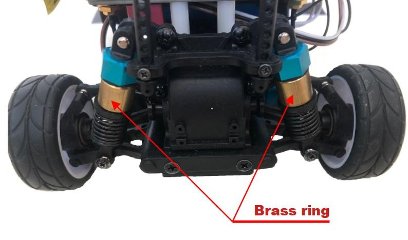
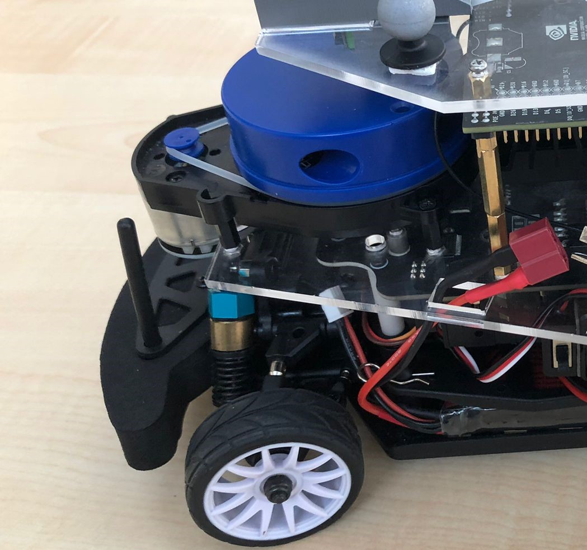
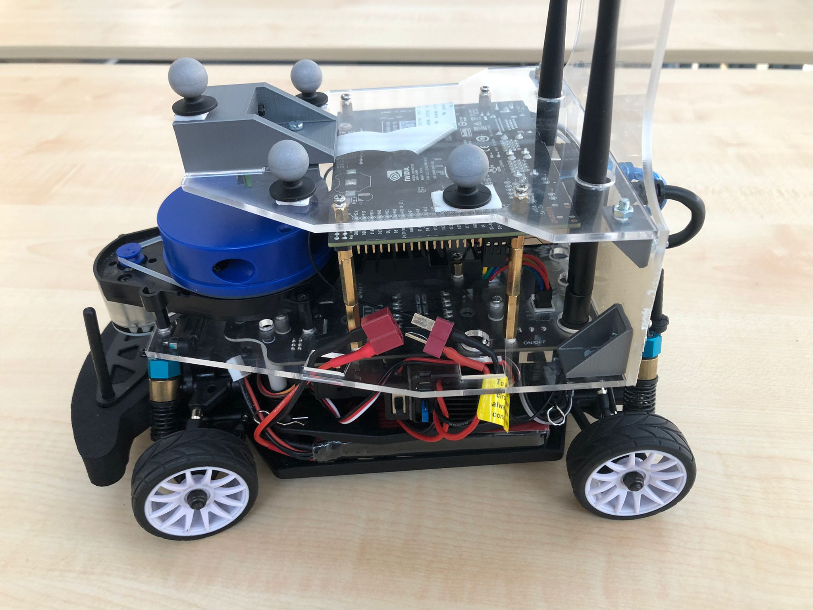
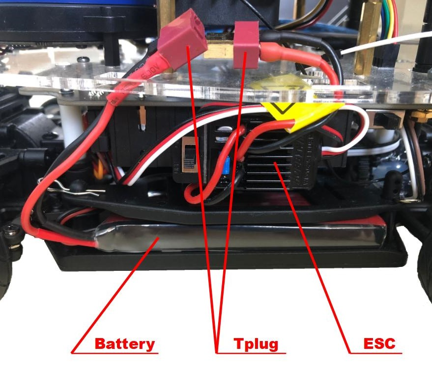

## DART build instructions

This build instructions assume that the base [Jetracer](https://www.waveshare.com/wiki/JetRacer_Pro_AI_Kit) platform has been correclty assembled according to the [manual](https://files.waveshare.com/upload/f/fa/Jetracer_pro_Assembly_EN.pdf), except for the camera frame setup and the jetson Nano placement that can be skipped. 

## Required components
The extra components needed to upgrade the base Jetracer platform are listed below:

- Ylidar X4 lidar. [link](https://www.ydlidar.com/products/view/5.html) 
- Arduino Nano [link](https://store.arduino.cc/products/arduino-nano)
- IMU BNO055
- LiPo battery: LiPo 7.4 V 1300 mAh 25 C Softcase BEC  and T plug adaptors
- Servomotor DS3225 (25 Kg)
- 4x brass ring (inner dimater 10m, outer diameter 12m and length 9-11mm). [link](https://www.bouwmaat.nl/bonfix-soldeerring-12x10-mm-10-stuks/product/0000567990)
- infrared sensor [link](https://www.otronic.nl/nl/infrarood-obstakel-vermijdingsmodule-hw-140567777.html)
- hall sensor [link](https://www.amazon.nl/-/en/Switch-Effect-A3144E-A3144EUA-sensor/dp/B09JYZXK6W)
- neodymium magnets [link](https://www.amazon.nl/-/en/Brudazon-mini-magnets-strongest-level/dp/B081562CCY/ref=sr_1_3?crid=2XFJOREJVPIOC&dib=eyJ2IjoiMSJ9.3Ebr56VvNfNU-xy-dzWQ6tKmij5KvE6q_t0zELK9mUn0W2LJXvLcyoYJMqIzu6tDkGjRrKXzXrrOEBmOfht_4a5mAQY5aXQvrMNU3lXQjv_D9TqVUPoB3R8L-3qmRJClefMNBk7Iz1OLkMccnhtm42_ugphnFQsufJNWI81f2L6efYcl7Lem22z6wK4wTxuhtxNedxUbBoZ0pjNDZUmvuTl7Aj1lW724WxfHb_tfCGMSuBzQo0pTRj6gOb3d3eyB3VDeKdVflXMUgnYB4OxIz6wuU_HuDT022dP5Jy9z2tw.7x1We_X4vFZQCEd8v1Z_4aqRrBxPFoEOh2iCBjo6Q7o&dib_tag=se&keywords=2x1+mm+neodymium+disc+magnets&qid=1715956757&sprefix=2x1+mm+neodymium+disc+magnets%2Caps%2C99&sr=8-3)
- PVC plates [link](3D_printing_files)
- 3D printed components [link](3D_printing_files)

## Sensor placement for Velocity readings

Remove the power distribution board. Now unscrew the top of the main driveshaft and take out the main driveshaft by removing the rear differential gear housing.

To receive a velocity reading from the car, we are going to place sensors near the main gear for RPM readings. This can be done by adding an IR sensor or a magnet sensor. Use both if you want to increase the accuracy of the RPM estimate. Both sensors will be shown in this building tutorial. 

Take out the main gear and glue the two small laser cutted parts, magnet_holder_with_5_holes.DXF and white_ring_irsensors.DXF, to the main gear. There is the chance that you may have to remove some plastic from the main gear to place te inlay. Now place 5 small magnets in the magnet inlay, so they are correctly spaced. Make sure that the magnets have the correct magnetic field facing from the main gear, so the Magnet sensor can read the magnets when moving in front of the sensor. It is also possible to stack 2 magnets vertically to increase the reliability of the detection. Applying super glue to fix the magnets in place is sufficient.

> [!NOTE]
> Picture shows previous version of magnet sensor with 4 magnets. The relative .DFX file is magnet_inlay.DXF, yet we advise to use the 5 magnet holder to produce more accurate readings.

  

Now use the IR sensor and the 3d printed sensor_gate.STL to create the IR sensor gate attached to the floor board of the DART.

  

The magnet sensor is placed on the rear differential gear housing using a 3D printed inlay (magnetsensor_holder.STL). 

  

## Servomotor placement

Before we rebuild DART lower body, a new servomotor can be placed. The new servomotor features higher torque and higher positional accuracy, improving the consistency of the steering behavior. Now the lower body can be rebuild until the power idstribution board has been placed back. First insert the main gear with the driveshaft and the rear differential gear housing. Place the driveshaft cover back and then attach the power distribution board.

## Shockabsorbers

Due to the increased weight of the platform and the soft springs in the schockabsorbers, we have to increase the stiffness from the springs. This can be done by inserting the brass rings.

  

## Full Design

For the top part of the DART we start by attaching the XD4 Lidar to the laser cutted baseboard.DXF And the spacers for the Jetson Nano. 

  

Attach the baseboard.DXF to the power distribution board. Now attach the Jetson Nano to the spacers upside down, as seen in the figure below. Make sure that the ports of the Jetson nano face backwards. 

To assemble the top plate, the camera is first inserted into the 3D printed camerafix.STL. This camerafix.STL with the camera is then mounted on the laser cutted upperboard.DXF. Then the board can be attached on top of the Jetson Nano using small spacers.

  

To attach the laser cutted back.DXF board, we use the small top holders, 3D printed smallholder.STL, and the bigger bottom holders, 3D printed holder.STL.

## Lipo battery placement

In the lower compartment that is not occupied by the servomotor and motor, can be used to insert the extra LiPo battery.

  

